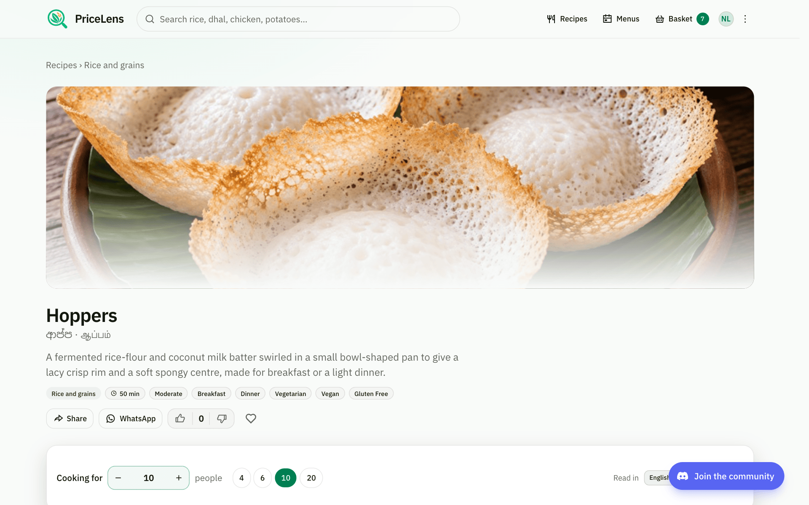
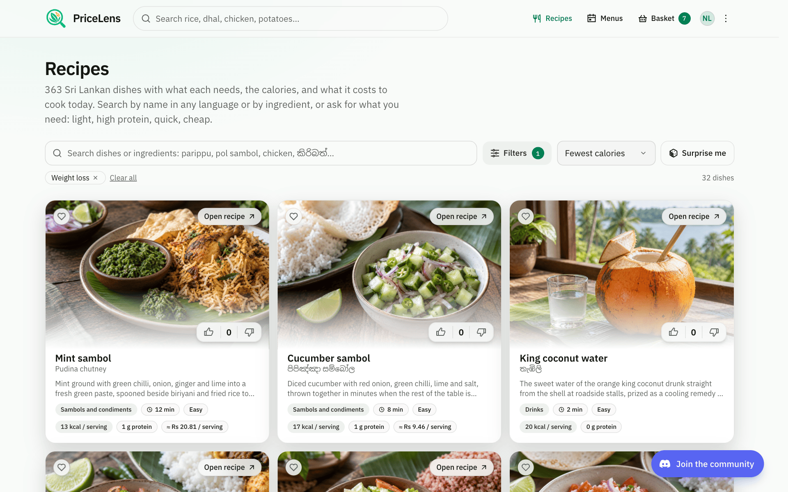
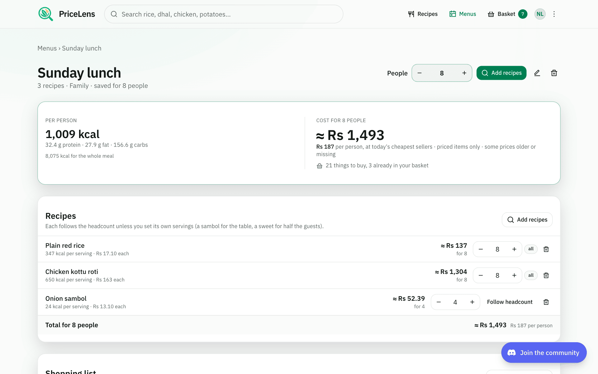

# Using PriceLens

PriceLens shows what food costs today across Sri Lanka's open markets and supermarkets, how
prices are moving, what a shopping list would cost at each store, and what to cook from it. It
is at [price.prabhavalabs.com](https://price.prabhavalabs.com), needs no account to read, and
works the same on a phone; an account keeps your menus and recipes. The same guide, with these
screenshots, is on the site at [price.prabhavalabs.com/guide](https://price.prabhavalabs.com/guide).

1. [Start here](#1-start-here)
2. [Find a product](#2-find-a-product)
3. [Read a price](#3-read-a-price)
4. [Follow the history](#4-follow-the-history)
5. [Build a basket](#5-build-a-basket)
6. [Compare stores](#6-compare-stores)
7. [Cook from your basket](#7-cook-from-your-basket)
8. [Cook for any number](#8-cook-for-any-number)
9. [Plan a menu](#9-plan-a-menu)
10. [Your account](#10-your-account)
11. [Phone and theme](#11-phone-and-theme)
12. [Feedback and privacy](#12-feedback-and-privacy)

## 1. Start here

The front page is the price board: every product with a published price, grouped by category,
with open markets and supermarkets side by side. The three figures at the top say how many
products, supermarkets, and official sources are behind the day's board, and when the latest
observations were made.

1. "Rising this month" and "Falling this month" pick out the biggest 30-day movers.
2. The category chips below narrow the board to vegetables, rice, fish, and so on; "All"
   brings everything back.
3. Open any card for that product's sellers and history.

*The front page: the day's movers, categories, and every product with a price.*

## 2. Find a product

The search box in the header matches names in English, Sinhala, and Tamil and forgives
spelling: "potatos", "b onion", and "dhal" all land. After a short pause it also adds products
by the wording a store or bulletin uses, so a shelf label finds the product it belongs to.

1. Click or tap the search box, or start typing on the front page.
2. With nothing typed it lists the products most people look at today.
3. Use the arrow keys and Enter, or tap a result, to open the product.

*Search understands rough spelling and store wording: "b onion" finds Big Onion.*

## 3. Read a price

A product's page lists every seller with a current price, by group: open markets (retail
prices surveyed by the Central Bank of Sri Lanka and the Department of Census and Statistics),
supermarkets (the online stores of Keells, Cargills, Glomark, and SPAR), and wholesale markets
(the HARTI daily bulletin). Every price carries the date it was observed.

1. Within each group the cheapest seller is marked; the summary cards give each group's
   average, and the supermarket card says how far above wholesale the shelves are today.
2. A product sold in several varieties shows them as badges; the sellers' ranges pool the
   varieties unless the product compares by a base variety.
3. A price older than its source allows (a week for a daily source, three weeks for a weekly
   one) is struck through with an "outdated" badge and how long ago it was seen. It never
   counts as the cheapest.

*A product: sellers by group with the cheapest marked, and the supermarket average against wholesale.*

*A price older than its source allows is struck through and marked outdated.*

Open-market prices come from surveys of selected markets and may differ at another stall on
the same day; supermarket prices are the online store's, which can differ from a branch.

## 4. Follow the history

Below the sellers, the history chart draws every seller's price over time.

1. Choose 30 days, 90 days, or a year.
2. Switch seller groups on and off with the round buttons above the chart to compare, say,
   supermarkets against wholesale alone.
3. Hover, or tap on a phone, any day to read every seller's price on it; the list under the
   chart names each line.
4. The range and the groups are kept in the page address, so copying the link, or using
   "Share", shows someone exactly the view you have.

*The history: pick a range, switch groups, hover or tap a day for every seller's price.*

## 5. Build a basket

The basket is your shopping list, in real amounts. It lives only in your browser: nothing is
uploaded and there is no account.

1. "Add" on a card or a product page puts the product in the basket, starting at half a kilo
   (or half a litre, or one piece). The button becomes the amount with − and + around it.
2. − and + step by a quarter kilo or litre, or one piece. Going below 50 g or one piece
   removes the item.
3. Tap the amount itself for presets (100 g to 5 kg, 250 ml to 2 l, 1 to 30 pieces) or type
   an exact figure in grams or kilos and press "Set".
4. The basket icon in the header opens a small dropdown from any page: adjust or remove items,
   clear the list (the bin asks once), or go to the comparison.

*Tap the amount for presets or an exact figure in grams or kilos.*

*The basket from any page: adjust, remove, clear, or compare stores.*

## 6. Compare stores

"Compare stores for this basket" opens the basket page, which prices the list at every
seller with observations from the last 30 days, in the amounts you set.

1. "Where it costs least" lists stores that carry the whole list first, then by total. The
   cheapest is badged; a store missing items says which, and the total is for what it carries.
2. "Your list" has the same −, +, and amount controls, and a search box to add more without
   leaving the page.
3. "Share" copies a link or opens WhatsApp with the list; "Clear" empties it.

*The basket page: stores that carry the whole list first, then by total; your list with amounts.*

## 7. Cook from your basket

Under the store comparison, "Cook with your basket" suggests dishes from a catalogue of 363
Sri Lankan dishes, best fit first: how many of a dish's key ingredients you already have, how
much of your basket it uses, and what is still to buy.

1. Each card names the dish, its kind, time, and difficulty, and what it still needs.
2. A dish page marks the ingredients already in your basket and prices the rest at today's
   cheapest seller, with an "Add" for each; the cost card says how many you have and what the
   rest would cost. Then pantry items, variants, and what it goes well with.
3. "Recipes" in the header browses the whole catalogue by name in any language or by
   ingredient.

*Dishes that fit what you have, best fit first, each saying what is still to buy.*

*A dish: every ingredient at today's cheapest price, the ones already in your basket marked, and the cost for the table.*

*The whole catalogue, searchable by name in any language or by ingredient.*

## 8. Cook for any number

Every dish carries a full recipe: quantities as you buy them, the method step by
step, and the numbers that follow from them. Set how many you are cooking for
and every amount scales; calories per serving and the cost per serving at
today's cheapest sellers come with it. The time does not change: a pot for
twenty simmers as long as a pot for four.

1. Use the "Cooking for" control or the 4, 6, 10, and 20 buttons. Salt, oil for
   tempering, and whole spices grow a little slower than the headcount, as they
   do in a real kitchen.
2. "Per serving" gives energy, protein, fat, carbohydrate, fibre, and sodium for
   one person's portion, computed from each ingredient's edible weight against a
   nutrition table built for Sri Lankan foods and checked against published
   composition tables.
3. The cost card prices the ingredients for the headcount at today's cheapest
   published seller, with the per-serving figure under it and how many
   ingredients are already in your basket. A "≈" means something is not priced
   yet or a price is older than a week; the card says which.
4. "Read in" switches the method between English, Sinhala, and Tamil. Sinhala
   and Tamil text is machine drafted until a person has reviewed it, and the
   page says so.
5. On the recipes page the chips and the calorie cap ask a question of the whole
   catalogue: weight loss, high protein, low calorie, quick, budget, and so on,
   sorted by fewest calories, most protein, quickest, or cheapest.
6. "Surprise me" beside the search, or in the ⋯ menu, opens one dish at random.
   Signed in, it follows the food preferences on your account and the banner
   above the recipe says why it was picked; "Another one" draws again without
   repeating a dish this tab has shown, and the banner links to the preferences.

## 9. Plan a menu

A menu is a meal for an occasion: a Sunday lunch, a poya dana, a birthday tea.
Name it, say how many are coming, add recipes from their pages, and the whole
meal is worked out: calories per person, cost per person at today's prices, and
one shopping list summed across every recipe.

1. On any recipe, "Add to a menu" adds it to a menu you have or starts a new
   one. "Menus" in the header lists them.
2. Each recipe follows the headcount unless you set its own servings: a sambol
   made for the table, a sweet for half the guests. "Follow headcount" puts it
   back.
3. Change the number of people and everything recomputes. "Add priced items to
   basket" moves the shopping list into your basket in real amounts, so the
   store comparison prices the whole meal; lines already in your basket are
   marked and left alone.
4. Menus are kept on your account, so they follow you to another phone. Menus
   made before you signed in are offered for saving the first time you open the
   page signed in.

## 10. Your account

Reading prices never needs an account. One keeps your menus and your own recipes on the
server, so they follow you to another phone or browser, and later carries price alerts. Sign
in with an email and a password, or with Google.

1. "Sign in" at the right of the header opens the sign-in page, on its own without the header
   and footer; "Create an account" asks for a name, an email, and a password of ten characters
   or more. Long beats complicated: a few words you will remember are better than a short
   jumble. "Continue as a guest" under the form goes back to the prices. Menus, your own
   recipes, and the account page need an account: open one signed out and the sign-in page
   appears, and once you are in you land straight back on the page you were opening. Prices,
   recipes, and the basket never ask.
2. A verification link goes to the address. Until you open it you can sign in and read
   everything, but menus and recipes wait; the thin bar under the header resends the link.
3. "Continue with Google" signs in with a Google account and needs no password. If the
   address already has a PriceLens account, Google joins it.
4. Your picture or initials in the header open the account menu: Account, Menus, My recipes,
   Sign out. The account page holds your name and language, your food preferences, your
   email and password, which mail you want, every device signed in (with "Sign out
   everywhere else"), and, at the bottom, deleting the account.
5. Food preferences shape "Surprise me" and the daily recipe ideas: what you eat
   (everything, vegetarian, vegan, pescatarian), what you avoid (egg, dairy, fish, meat,
   gluten), what you are after (weight loss, high protein, quick, budget, and so on), and
   the kinds of dish you like. Each choice saves as you make it. Under Notifications, switch
   on the daily recipe ideas or the daily price digest; the mails go out once the
   newsletters run.
6. Forgot the password? "Forgot password?" on the sign-in page mails a link that works for an
   hour; using it signs every other device out.

Five wrong passwords in a row lock sign-in for fifteen minutes; the wait is the same whether
the address has an account or not. Deleting the account removes your menus and recipes with
it. The basket in this browser stays, since it was never uploaded.

## 11. Phone and theme

Everything works on a phone: the header keeps the search box, recipes, menus, the basket, and
your account, with the rest behind the ⋯ menu; cards stack in one column; the chart answers to
a tap instead of a hover.

1. The theme follows your device. The ⋯ menu at the right of the header offers Light, Dark,
   or Device setting, and remembers the choice in this browser.
2. Add the site to your home screen from the browser's share menu to open it like an app.

*Dark theme, chosen from the header or following your device.*

| | |
| --- | --- |
|  |  |

## 12. Feedback and privacy

"Send feedback" in the ⋯ menu at the right of the header, or the link in the footer, opens a
short form: choose Feedback or Report a bug, write at least ten characters, and leave an email only if you want a reply. The
page you were on is attached automatically and the message is forwarded to the site's owner.

The footer quietly counts how many people are on the site right now, using a random id kept
only for the open tab; no cookies. Your basket and theme stay in your browser. Where the site
runs Google Analytics it does so with IP anonymisation and respects the browser's "do not
track" setting. The footer is one line: where the site is made (Sri Lanka), then Guide,
Sources, Privacy, Terms, Feedback, and Discord. The privacy policy (`/privacy`) says what the
site keeps about you and the terms of use (`/terms`) carry the disclaimers about prices;
sources, permissions, and method are on the About page. The Discord button in the bottom
corner joins the Prabhava Labs community, where PriceLens updates land first; the same link
sits in the ⋯ menu and the footer.

*Feedback or a bug report, with the page you were on attached automatically.*
