# Using PriceLens

PriceLens shows what food costs today across Sri Lanka's open markets and supermarkets, how
prices are moving, what a shopping list would cost at each store, and what to cook from it. It
is at [price.prabhavalabs.com](https://price.prabhavalabs.com), needs no account, and works the
same on a phone. The same guide, with these screenshots, is on the site at
[price.prabhavalabs.com/guide](https://price.prabhavalabs.com/guide).

1. [Start here](#1-start-here)
2. [Find a product](#2-find-a-product)
3. [Read a price](#3-read-a-price)
4. [Follow the history](#4-follow-the-history)
5. [Build a basket](#5-build-a-basket)
6. [Compare stores](#6-compare-stores)
7. [Cook from your basket](#7-cook-from-your-basket)
8. [Phone and theme](#8-phone-and-theme)
9. [Feedback and privacy](#9-feedback-and-privacy)

## 1. Start here

The front page is the price board: every product with a published price, grouped by category,
with open markets and supermarkets side by side. The three figures at the top say how many
products, supermarkets, and official sources are behind the day's board, and when the latest
observations were made.

1. "Rising this month" and "Falling this month" pick out the biggest 30-day movers.
2. The category chips below narrow the board to vegetables, rice, fish, and so on; "All"
   brings everything back.
3. Open any card for that product's sellers and history.

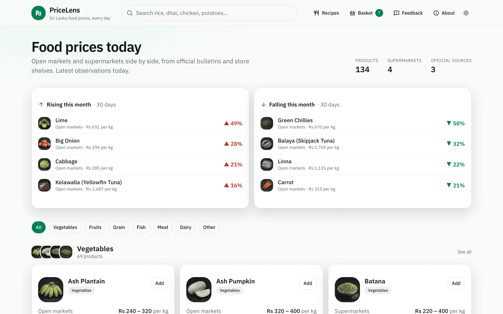

*The front page: the day's movers, categories, and every product with a price.*

## 2. Find a product

The search box in the header matches names in English, Sinhala, and Tamil and forgives
spelling: "potatos", "b onion", and "dhal" all land. After a short pause it also adds products
by the wording a store or bulletin uses, so a shelf label finds the product it belongs to.

1. Click or tap the search box, or start typing on the front page.
2. With nothing typed it lists the products most people look at today.
3. Use the arrow keys and Enter, or tap a result, to open the product.

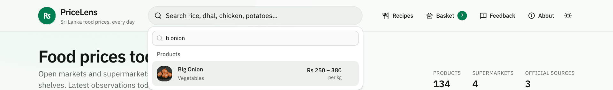

*Search understands rough spelling and store wording: "b onion" finds Big Onion.*

## 3. Read a price

A product's page lists every seller with a current price, by group: open markets (retail
prices surveyed by the Central Bank of Sri Lanka and the Department of Census and Statistics),
supermarkets (the online stores of Keells, Cargills, Glomark, and SPAR), and wholesale markets
(the HARTI daily bulletin). Every price carries the date it was observed.

1. Within each group the cheapest seller is marked; the summary cards give each group's
   average, and the supermarket card says how far above wholesale the shelves are today.
2. A product sold in several varieties shows them as badges; the sellers' ranges pool the
   varieties unless the product compares by a base variety.
3. A price older than its source allows (a week for a daily source, three weeks for a weekly
   one) is struck through with an "outdated" badge and how long ago it was seen. It never
   counts as the cheapest.

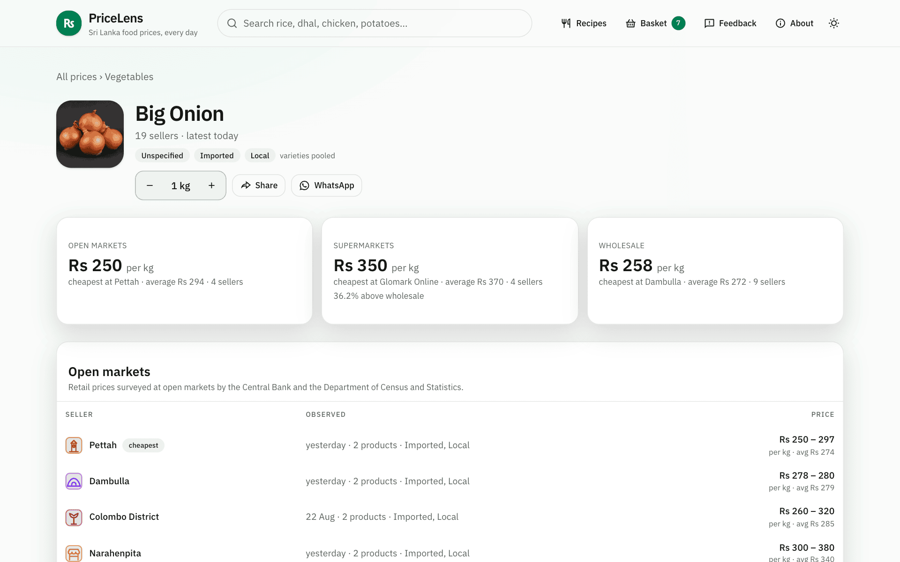

*A product: sellers by group with the cheapest marked, and the supermarket average against wholesale.*

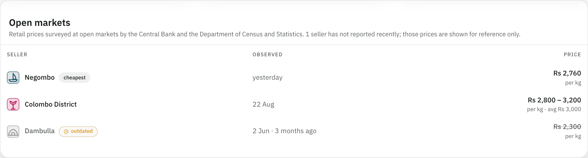

*A price older than its source allows is struck through and marked outdated.*

Open-market prices come from surveys of selected markets and may differ at another stall on
the same day; supermarket prices are the online store's, which can differ from a branch.

## 4. Follow the history

Below the sellers, the history chart draws every seller's price over time.

1. Choose 30 days, 90 days, or a year.
2. Switch seller groups on and off with the round buttons above the chart to compare, say,
   supermarkets against wholesale alone.
3. Hover, or tap on a phone, any day to read every seller's price on it; the list under the
   chart names each line.
4. The range and the groups are kept in the page address, so copying the link, or using
   "Share", shows someone exactly the view you have.

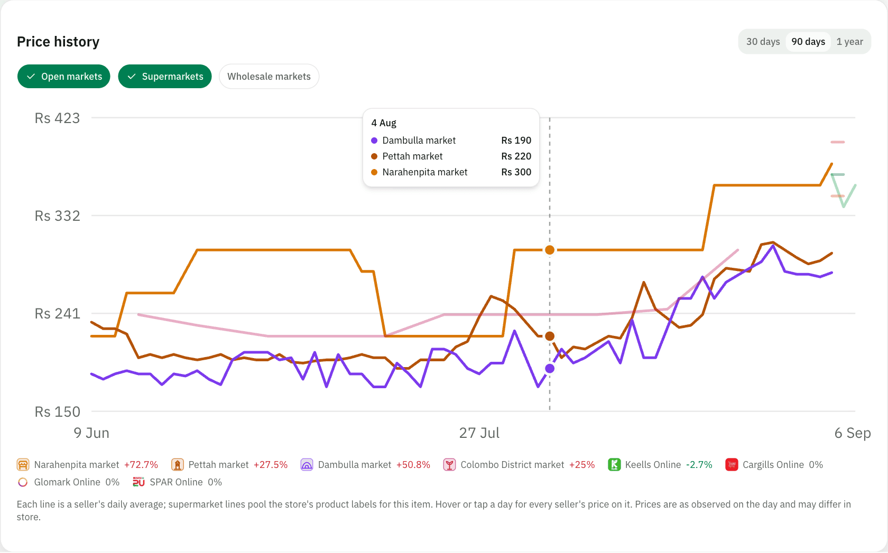

*The history: pick a range, switch groups, hover or tap a day for every seller's price.*

## 5. Build a basket

The basket is your shopping list, in real amounts. It lives only in your browser: nothing is
uploaded and there is no account.

1. "Add" on a card or a product page puts the product in the basket, starting at half a kilo
   (or half a litre, or one piece). The button becomes the amount with − and + around it.
2. − and + step by a quarter kilo or litre, or one piece. Going below 50 g or one piece
   removes the item.
3. Tap the amount itself for presets (100 g to 5 kg, 250 ml to 2 l, 1 to 30 pieces) or type
   an exact figure in grams or kilos and press "Set".
4. The basket icon in the header opens a small dropdown from any page: adjust or remove items,
   clear the list (the bin asks once), or go to the comparison.

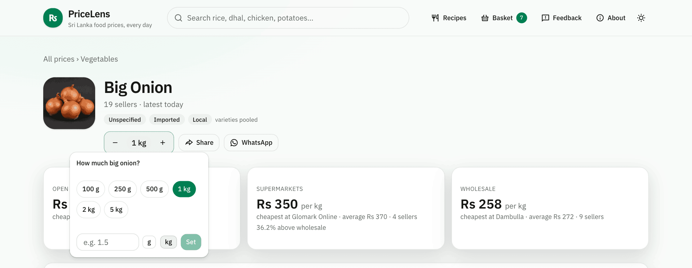

*Tap the amount for presets or an exact figure in grams or kilos.*

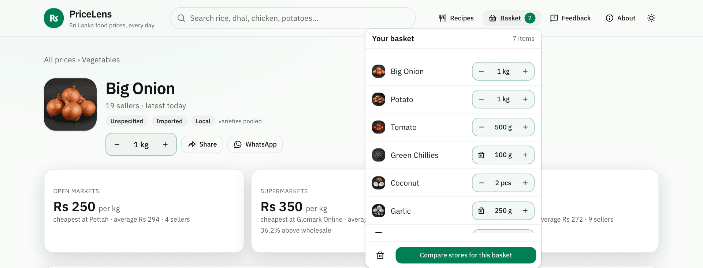

*The basket from any page: adjust, remove, clear, or compare stores.*

## 6. Compare stores

"Compare stores for this basket" opens the basket page, which prices the list at every
seller with observations from the last 30 days, in the amounts you set.

1. "Where it costs least" lists stores that carry the whole list first, then by total. The
   cheapest is badged; a store missing items says which, and the total is for what it carries.
2. "Your list" has the same −, +, and amount controls, and a search box to add more without
   leaving the page.
3. "Share" copies a link or opens WhatsApp with the list; "Clear" empties it.

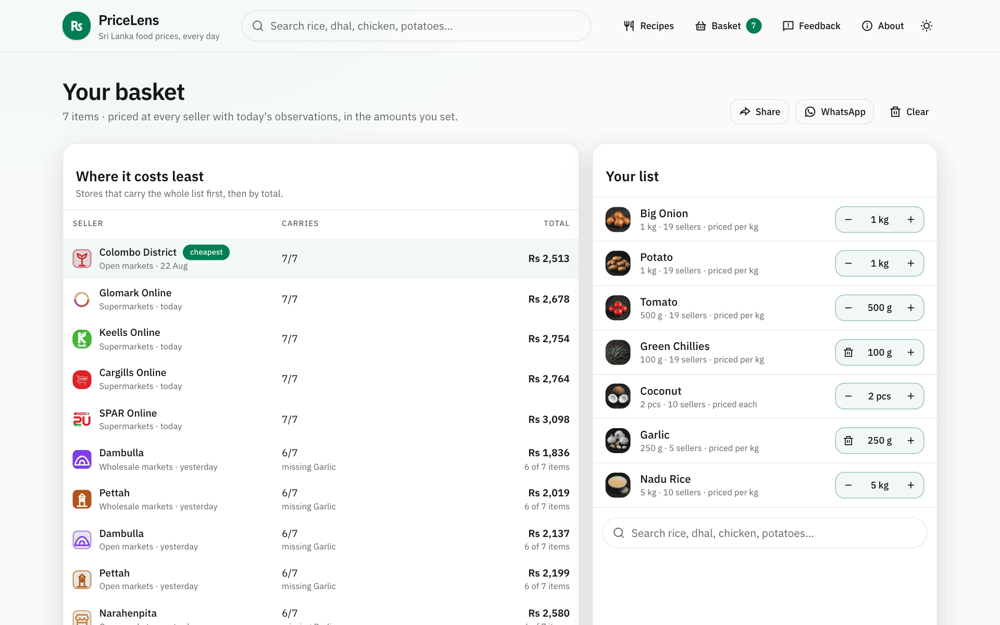

*The basket page: stores that carry the whole list first, then by total; your list with amounts.*

## 7. Cook from your basket

Under the store comparison, "Cook with your basket" suggests dishes from a catalogue of 363
Sri Lankan dishes, best fit first: how many of a dish's key ingredients you already have, how
much of your basket it uses, and what is still to buy.

1. Each card names the dish, its kind, time, and difficulty, and what it still needs.
2. A dish page splits its ingredients into "From your basket" and "Still to buy", the latter
   at today's cheapest price per unit with an "Add" for each, then pantry items, variants, and
   what it goes well with, with a rough extra cost.
3. "Recipes" in the header browses the whole catalogue by name in any language or by
   ingredient.

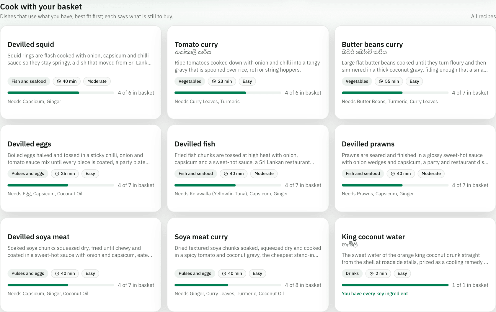

*Dishes that fit what you have, best fit first, each saying what is still to buy.*

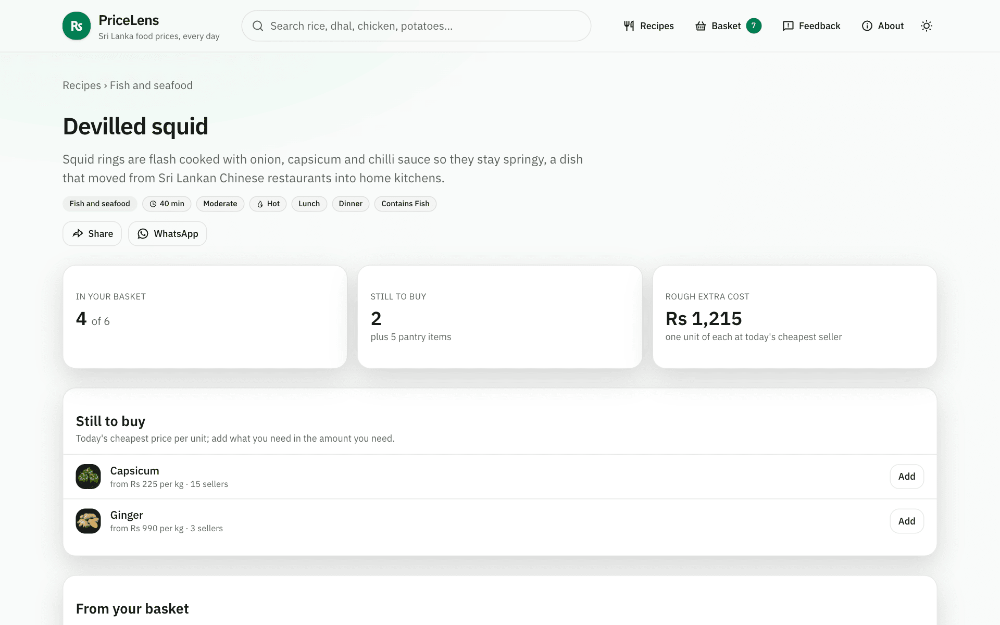

*A dish: what you have, what is still to buy at today's cheapest price, and the rough extra cost.*

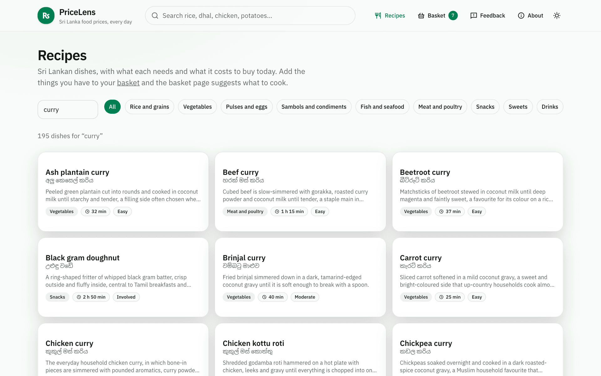

*The whole catalogue, searchable by name in any language or by ingredient.*

## 8. Phone and theme

Everything works on a phone: the header keeps the search box, the basket, and the menu; cards
stack in one column; the chart answers to a tap instead of a hover.

1. The theme follows your device. The icon at the right of the header offers Light, Dark, or
   Device setting, and remembers the choice in this browser.
2. Add the site to your home screen from the browser's share menu to open it like an app.

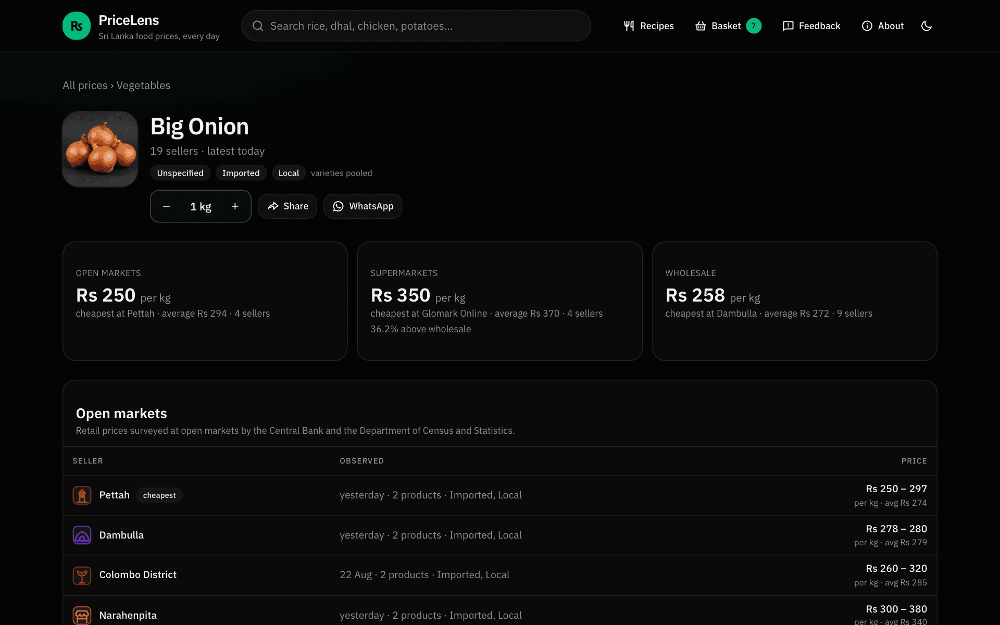

*Dark theme, chosen from the header or following your device.*

| | |
| --- | --- |
| 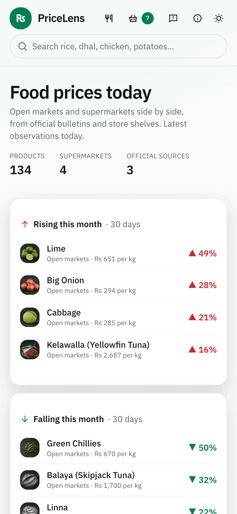 | 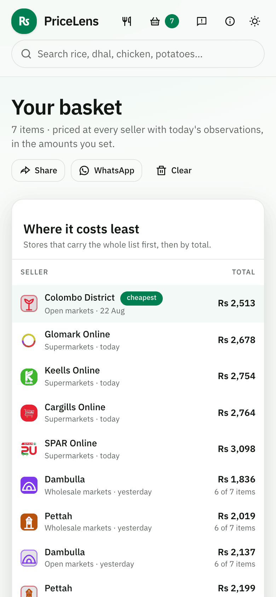 |

## 9. Feedback and privacy

"Feedback" in the header, or the link in the footer, opens a short form: choose Feedback or
Report a bug, write at least ten characters, and leave an email only if you want a reply. The
page you were on is attached automatically and the message is forwarded to the site's owner.

The footer quietly counts how many people are on the site right now, using a random id kept
only for the open tab; no cookies. Your basket and theme stay in your browser. Where the site
runs Google Analytics it does so with IP anonymisation and respects the browser's "do not
track" setting. Sources, permissions, and method are on the About page.

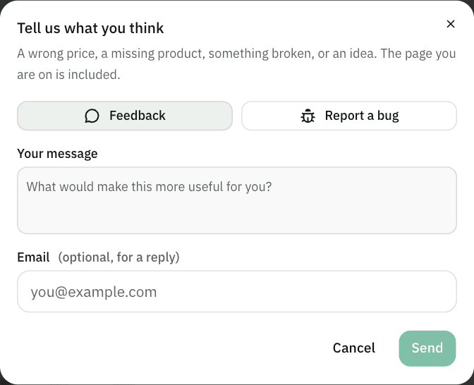

*Feedback or a bug report, with the page you were on attached automatically.*
